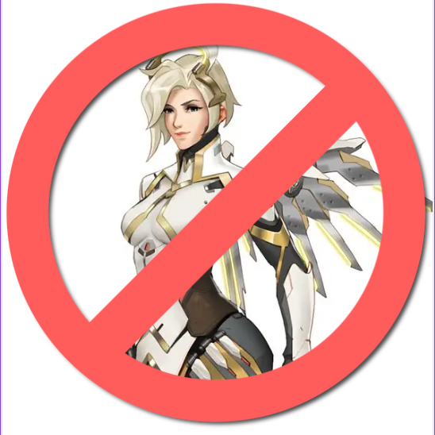

# No Mercy Tracker

A cross-platform Electron desktop application for tracking Overwatch games and analyzing the effectiveness of banning Mercy.



## Features

-   **Game Tracking**: Record your Overwatch matches with Mercy ban status and results
-   **Statistics Dashboard**: Compare win rates when Mercy is banned vs. not banned
-   **Local Data Storage**: All data is stored locally in CSV format for privacy and portability
-   **Cross-Platform**: Supports macOS (Intel & Apple Silicon), Windows, and Linux
-   **Clean Interface**: Modern, intuitive UI focused on data entry and analysis

## Quick Installation

### One-Command Build

After cloning this repository, you can build the app for your platform with a single command:

```bash
# Clone the repository
git clone https://github.com/Rancor38/TheNoMercyApp.git
cd TheNoMercyApp

# Install dependencies and build the app
npm install
npm run install-app
```

The `npm run install-app` command will:

1. 🔍 Detect your operating system and architecture
2. 📦 Install all dependencies
3. 🎨 Generate platform-specific icons
4. ⚙️ Build the React application
5. 📱 Create the Electron desktop app
6. 📁 Place the ready-to-install app in `../TheNoMercyApp-Built/`

### Platform Support

-   **macOS**: Generates `.dmg` installer and `.app` bundle
    -   Intel Macs (x64)
    -   Apple Silicon Macs (arm64)
-   **Windows**: Generates `.exe` installer
    -   64-bit and 32-bit support
-   **Linux**: Generates `.AppImage` file

## Manual Build Commands

If you prefer to build manually:

```bash
# Install dependencies
npm install

# Build for macOS (both Intel and Apple Silicon)
npm run dist-mac

# Build for Windows
npx electron-builder --win

# Build for Linux
npx electron-builder --linux

# Build for all platforms
npm run dist
```

## Development

### Running in Development Mode

```bash
# Start the React dev server and Electron together
npm run electron-dev

# Or run them separately:
npm run dev        # Start Vite dev server
npm run electron   # Start Electron (after dev server is running)
```

### Project Structure

```
TheNoMercyApp/
├── src/                    # React source code
│   ├── App.jsx            # Main React component
│   ├── App.css            # Application styles
│   └── assets/            # Static assets
├── public/                # Public assets
├── electron.js            # Electron main process
├── preload.js             # Electron preload script
├── install-app.js         # Cross-platform installation script
└── package.json           # Dependencies and scripts
```

### Key Technologies

-   **Frontend**: React 19 + Vite
-   **Desktop**: Electron
-   **Styling**: CSS with modern layout techniques
-   **Build**: electron-builder for cross-platform packaging
-   **Icons**: png2icons for multi-format icon generation

## Data Storage

Game data is automatically saved to a CSV file in the application directory:

-   **Location**: Same folder as the application executable
-   **Format**: CSV with columns for date, Mercy ban status, game result, and notes
-   **Privacy**: All data stays on your device - no cloud sync or data collection

## Screenshots

_Add screenshots of your application here_

## Contributing

1. Fork the repository
2. Create a feature branch: `git checkout -b feature-name`
3. Make your changes
4. Test the build: `npm run install-app`
5. Submit a pull request

## License

[Add your license here]

## Support

If you encounter any issues:

1. Check that you have Node.js 20.19+ installed
2. Try deleting `node_modules` and running `npm install` again
3. Make sure you have the `no-mercy.png` logo in the `public/` folder
4. Open an issue with your OS, Node version, and error details

---

**Built with ❤️ for the Overwatch community**
